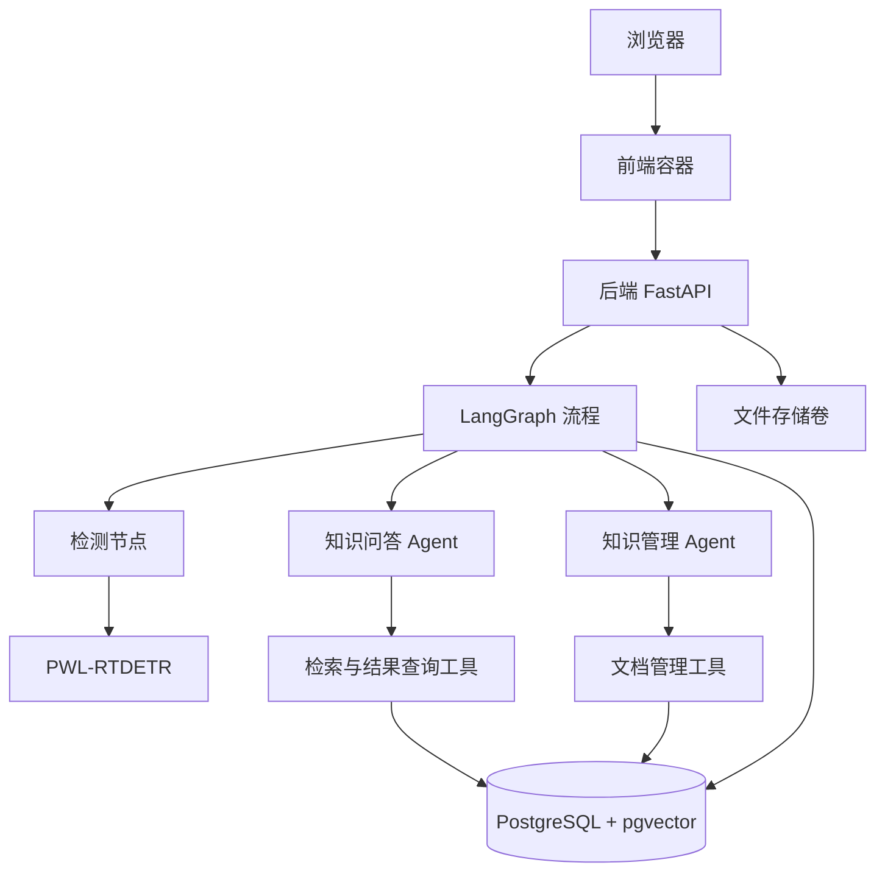

# 项目实施规划

## 1. 项目目标

本项目面向无人机红外小目标检测，将 PWL-RTDETR 与领域知识库结合，提供三个功能：

- **图片检测**：上传红外图片，返回带检测框的结果图，以及类别、坐标和置信度。
- **知识问答**：围绕论文、模型结构和实验资料回答问题，并给出资料来源。
- **知识库管理**：通过自然语言查找、比较和维护文档，覆盖已有知识前由用户确认。

使用 LangGraph 编排业务流程，问答 Agent 和知识管理 Agent 分别承担各自职责。目标检测是普通 Python 节点，不需要 LLM 执行推理或绘图。

第一版以图片检测和 Markdown（.md） 文档为范围，暂不开发训练、视频检测、PDF/OCR 入库和本地大模型部署。

### 用户与公共知识库

上传只接受两类文件：

| 文件类型 | 格式 | 用途 |
| --- | --- | --- |
| 检测图片 | .jpg、.jpeg、.png | 目标检测，原图和结果仅所属用户可访问，不进入知识库 |
| 知识文档 | .md | 判断新增、重复或更新，入库后供所有登录用户检索，覆盖前确认 |

TXT、PDF、Word 不在首版上传范围。“待入库”和“已入库”是 Markdown 的处理阶段，不是额外文件类型。后端校验用途和实际文件内容。

注册、登录和退出纳入第一版。后端验证 JWT 后识别 user_id，不使用匿名访客或固定开发用户作为交付方案。前端通过 Authorization Bearer 携带令牌；退出清除前端令牌，不建登录会话表，不做刷新令牌，已签发 JWT 在过期前仍有效。

密码按个人项目要求明文保存，仅使用不与其他账号重复的测试密码；数据库和备份可直接读取密码，面向真实用户前需改为密码哈希。私有图片通过带 JWT 的请求获取 Blob 后显示，不将令牌放进图片 URL。

- 图片、检测任务、聊天记录、会话检查点和个人偏好按用户隔离。
- 知识库为全站公共知识库，所有登录用户都可以查询、新增和更新，不设管理员角色或知识库角色权限体系。
- 未登录用户不能访问业务数据或操作知识库。公共表示所有登录用户共享，不表示匿名开放。
- 知识文档记录创建人，每个版本和变更记录操作人，用于追溯，不限制其他登录用户维护文档。
- 上传的 Markdown 在入库前称为“待入库文件”，仅上传者可访问；成功入库后称为“已入库的公共知识文档”，内容及发布版本对所有登录用户开放。
- 所有人均可发起变更，但只能确认或取消自己发起的待确认操作，不得操作他人的聊天流程。覆盖确认和版本冲突检查保留。

## 2. 当前进度

目前已完成 PWL-RTDETR 本地检测准备：

- 模型权重位于 `RTDETR-main-code/pwl_rtdetr/best.pt`。
- `predict_pwl.py` 已能执行单张图片预测。
- 已在 Python 3.11、PyTorch 2.0.1 CPU 环境验证单张预测。
- 已修复小波卷积调用旧序列化函数时的 `unknown opcode` 问题。
- 已准备 6 张 HIT-UAV 测试图片，其中一张已与原 Python 3.8 环境的结果对比一致，比较范围为导出文本的精度。
- 安装步骤记录在 `RTDETR-main-code/环境安装与运行.md`。

接下来开发业务后端、Agent、知识库和前端。统一环境安装 Agent 依赖后的兼容性，以及 Linux Docker 中的预测效果，仍需要实际验证。

## 3. 整体架构

最终部署在 WSL 2 的 Docker 中，通过 Docker Compose 管理三个容器：

| 容器 | 组成 | 职责 |
| --- | --- | --- |
| frontend | 前端页面 + Nginx | 页面展示，代理后端请求 |
| backend | Python 3.11 + FastAPI + LangGraph + LangChain + PWL-RTDETR | 检测、Agent、知识库与业务接口 |
| db | PostgreSQL + pgvector | 业务数据、知识向量、会话状态和长期记忆 |

后端使用一套 Python 环境，直接调用项目中的 PWL-RTDETR 源码，不拆分独立检测容器。pgvector 是 PostgreSQL 扩展，不单独部署。

前端建议采用 Vue 3 + TypeScript + Vite，构建后由 Nginx 提供静态页面。LLM 和 Embedding 先使用可配置的外部 API，具体提供商在接入时确定。



图中的检测节点、模型、Agent 和工具都属于后端内部模块，不是额外容器。

## 4. 三条核心业务流程

### 4.1 图片检测

检测流程为：

**上传图片 → 保存原图 → 调用模型 → 保存结果图与检测数据 → 返回前端展示。**

后端为每次检测生成 UUID，使用独立目录存储文件。容器内统一存储根目录为 `/app/storage`：

```text
/app/storage/
├── detections/
│   └── <任务 UUID>/
│       ├── input.jpg       原始图片，也可以是 input.png
│       ├── result.jpg      带检测框的结果图
│       └── result.json     检测结果快照
├── uploads/                尚未关联任务的聊天附件
└── documents/              知识文档及版本文件
```

检测页可以直接上传图片并发起检测；聊天附件先上传取得文件 ID，用户要求检测时，由后端将附件复制到任务目录。两种入口复用同一个检测服务。

后端启动时加载一次模型，后续请求复用。预测时传入具体原图路径，不传入包含结果图的整个任务目录；模型使用 `save=False`，由业务代码将结果图保存到约定位置，避免自动生成实验目录。

响应包含任务 ID、状态、原图与结果图 URL，以及检测框列表。前端通过图片 URL 展示结果；FastAPI 校验任务归属后使用 `FileResponse` 返回图片，不把服务器绝对路径交给前端。

数据库保存任务参数、状态、结果和相对存储路径，`result.json` 是同一结果的文件快照。未检测到目标是正常成功结果，检测列表为空。

首版使用一个后端 worker，并限制同时执行一次模型推理。推理放入受控线程，避免阻塞异步接口；每次请求不重新加载模型，也不通过 subprocess 启动预测脚本。

### 4.2 领域知识问答

问答流程为：

**用户提问 → Agent 检索知识 → 判断资料是否足够 → 回答并附上来源。**

知识来源包括论文、模型说明、实验记录等 Markdown（.md） 文档。入库服务负责内容清洗、分块、Embedding 和向量写入，保留文档标题、版本及片段位置。

问答 Agent 先提供两个工具：

| 工具 | 用途 |
| --- | --- |
| 检索知识 | 查找相关文档片段与出处 |
| 查询检测结果 | 读取当前用户某次检测的结构化结果 |

资料不足时允许有限次数改写查询，仍无证据则明确说明。回答不能编造引用。纯文本 LLM 可以解释检测 JSON 中的类别、数量和置信度，但不能据此声称看懂图片或确定漏检原因。

第一版先完成向量检索；之后加入 BM25 和 RRF 混合检索，通过同一评测集比较效果，再决定是否启用。

### 4.3 知识库管理

管理流程为：

**上传文档并提出要求 → 查找已有内容 → 判断新增或更新 → 展示差异 → 用户确认覆盖 → 更新并验证。**

知识管理 Agent 可以调用搜索文档、读取版本、比较内容、提出变更和执行已确认变更等工具。新增可依据用户明确请求执行，覆盖必须经过确认。

后端记录待确认操作，绑定用户、目标文档、旧版本和新内容。执行前检查确认记录与版本，不能仅依赖 Agent 的文字判断。如果确认期间文档已更新，需要重新比较。

文档更新保留历史版本。新内容完成解析、向量化和写入后，才切换有效版本；失败时旧版本仍可检索。重复上传、重复确认和流程重试应保持幂等。

## 5. LangGraph 与 Agent 的职责

外层 LangGraph 负责路由和协调，不把所有业务逻辑都放进提示词。

| 用户操作 | 处理方式 |
| --- | --- |
| 点击“开始检测” | 直接调用检测节点 |
| 聊天中要求检测图片 | 意图路由后进入检测节点；没有图片则询问补充 |
| 提问模型或论文知识 | 进入问答 Agent |
| 追问上一次检测结果 | 问答 Agent 查询任务结果后解释 |
| 要求新增或更新知识 | 进入知识管理 Agent |
| 请求不清楚 | 先澄清 |

两个 Agent 可以共用底层 LLM，但使用不同提示词和工具权限。服务启动时创建 Agent、数据库资源和流程图，每次请求复用。

会话 ID、任务 ID、文件 ID 和文档 ID 统一使用 UUID v4。新会话生成 `thread_id`，后续消息复用，不为每条消息重新生成。时间排序使用 `created_at`，不依赖 ID 顺序。

会话状态通过 PostgreSQL checkpointer 持久化；用户明确确认的长期偏好通过 PostgresStore 保存，并按用户隔离。图片和文档使用引用进入图状态，不把模型对象、数据库连接或图片二进制放进检查点。

Middleware 负责动态上下文、工具调用记录、超时和次数限制。子图暂停、用户确认和重启恢复需要测试，不能仅因外层使用 checkpointer 就宣称所有内部步骤不会重复执行。

## 6. 后端模块和接口

后端按职责组织，HTTP 接口、Agent 工具和图节点共用业务服务：

| 模块 | 职责 |
| --- | --- |
| api | 接收请求、参数校验和响应 |
| services | 检测封装、文件存储、文档入库和检索 |
| agents | 问答与知识管理 Agent |
| tools | 为 Agent 提供受控业务能力 |
| graph | 状态、节点、路由和图构建 |
| repositories | 数据库读写 |
| core | 配置、生命周期、日志和身份上下文 |

首版接口范围：

| 接口 | 功能 |
| --- | --- |
| `POST /api/auth/register` | 注册账号 |
| `POST /api/auth/login` | 校验用户名密码，签发 JWT |
| `GET /api/auth/me` | 查询当前用户 |
| `POST /api/files` | 上传检测图片或待入库 Markdown，返回文件 ID |
| `POST /api/detections` | 接收图片或已有文件 ID（二选一），创建并执行检测 |
| `GET /api/detections/{id}` | 获取任务状态和检测结果 |
| `GET /api/detections/{id}/original` | 返回原图 |
| `GET /api/detections/{id}/image` | 返回结果图 |
| `POST /api/conversations` | 创建会话 |
| `POST /api/chat` | 提交消息、会话 ID 和附件引用 |
| `GET /api/documents` | 查询知识文档 |
| `GET /api/documents/{id}/versions` | 查询文档版本 |
| `POST /api/knowledge/operations/{id}/confirm` | 确认指定变更 |
| `POST /api/knowledge/operations/{id}/cancel` | 取消指定变更 |
| `GET /api/health/ready` | 检查数据库和模型就绪状态 |

检测结果中的每个目标包含 `class_id`、`class_name`、`confidence` 和原图像素坐标 `bbox_xyxy`。类别从权重读取，不另写一份可能失配的映射。

数据库主要保存文件、检测任务、会话、文档、文档版本、分块向量和知识变更操作。业务表与 LangGraph 组件表分别管理；数据库不存图片二进制，图片放文件卷。

## 7. 建议目录结构

```text
infrared-agent/
├── README.md
├── docs/
│   └── 项目实施规划.md
├── RTDETR-main-code/          已有模型源码、权重和测试入口
├── backend/
│   ├── app/
│   │   ├── main.py
│   │   ├── api/
│   │   ├── core/
│   │   ├── schemas/
│   │   ├── services/
│   │   ├── agents/
│   │   ├── tools/
│   │   ├── graph/
│   │   └── repositories/
│   ├── migrations/
│   ├── tests/
│   ├── requirements-linux.lock.txt
│   └── Dockerfile
├── frontend/
│   ├── src/
│   ├── nginx.conf
│   └── Dockerfile
├── evals/                    检测回归与问答评测数据
├── compose.yaml
├── .env.example
└── .dockerignore
```

此结构为后续实施目标，不代表文件已经创建。暂不深度裁剪模型库，后端明确加载本地自定义 `ultralytics`，保留已有兼容修复。

## 8. 开发顺序与验收标准

### 第一阶段：统一环境与检测服务封装

先验证 FastAPI、LangGraph、LangChain 与当前模型依赖共存，锁定版本。将预测脚本提取为 Detector 类，统一加载、预测和结果转换接口。

同时提前做最小 Linux 容器验证，避免到项目末期才发现权重或依赖不能在部署环境运行。

**验收：**6 张图片能在统一环境和 Linux 容器中预测；结果在约定数值容差内与基线一致；模型只加载一次。

### 第二阶段：完成图片检测闭环

实现 FastAPI、用户表、JWT 注册登录和前端退出、数据库迁移、图片上传、任务目录、预测调用、结果查询和文件返回。前端先实现注册登录页及上传与检测页。

**验收：**两个账号均可注册登录和退出，不能互看个人图片或会话；用户能通过页面上传图片并查看结果；重启后历史任务仍可查询；同名文件、空结果、坏图片和失败任务均能正确处理。

### 第三阶段：完成知识问答

实现 Markdown（.md） 入库、文档分块、向量检索、问答 Agent 和 LangGraph 路由。前端加入聊天区、会话列表和引用展示。

**验收：**至少准备 20 个领域问题和资料不足案例；回答有可定位来源，能追问检测结果，无资料时不编造答案。

### 第四阶段：完成知识管理

实现查重、版本、变更建议、确认和更新工具。前端加入文档列表、差异展示和确认面板。

**验收：**用户 A 新增的知识，用户 B 登录后可以检索并发起更新；无需管理员角色。未经确认不能覆盖，不能确认他人的操作，重复确认不重复写入；版本冲突可识别，失败不破坏旧版本。

### 第五阶段：完善持久化与检索效果

接入会话检查点、长期偏好、调用日志、有限重试和恢复流程。增加 BM25 + RRF，并与向量检索基线比较。

**验收：**重启后会话可继续；确认恢复不会重复覆盖；用户数据隔离；检索改进有评测依据。

### 第六阶段：三容器部署与整体演示

完成前后端镜像、数据库初始化、持久卷、健康检查和 Compose 配置。整理环境变量、启动、备份和恢复说明。

**验收：**在 WSL 中按说明完成配置后，一条命令启动三个容器；三条业务流程均可演示；替换后端容器不会丢失图片和文档。

## 9. WSL 与 Docker Compose 部署

部署使用 Linux 容器，建议将部署副本放在 WSL 的 Linux 文件系统，例如 `~/projects/infrared-agent`。Windows Conda 只用于本地开发，Docker 镜像中重新安装 Python 3.11 和 Linux 依赖，不能使用 Windows wheel 直链。

前端采用多阶段构建：Node 构建静态资源，Nginx 负责运行。后端镜像包含 FastAPI、Agent 和模型源码，权重只读挂载，并通过 `MODEL_PATH` 配置。数据库使用固定版本的 PostgreSQL + pgvector 镜像，在目标数据库启用 vector 扩展。

| 项目 | 约定 |
| --- | --- |
| 访问入口 | 前端端口，例如 `http://localhost:8080` |
| API 请求 | Nginx 将 `/api` 转发到 `backend:8000` |
| 数据库连接 | 后端连接 `db:5432`，默认不向宿主机开放数据库端口 |
| 图片与文档 | `app_storage` 命名卷挂载后端 `/app/storage` |
| 数据库数据 | `pg_data` 命名卷，挂载点按选定镜像版本配置 |
| 模型 | 只读挂载到后端，启动时检查文件存在 |
| 密钥 | 通过环境变量注入后端，不进入前端构建产物 |

数据库健康后，后端执行迁移和组件初始化，再加载模型与流程图；后端就绪后前端提供完整服务。数据库首次初始化脚本只用于空数据卷，后续升级必须使用迁移。

最终部署方式如下；当前尚未创建 Compose 配置，命令是交付目标：

```bash
# 首次准备：安装 Docker/Compose，准备权重并填写配置
cp .env.example .env

# 配置完成后，一条命令构建并启动
 docker compose up -d --build
```

常用检查和停止命令：

```bash
docker compose ps
docker compose logs -f backend
docker compose down
```

停止时默认不加 `-v`，避免删除数据卷。命名卷用于持久化，不替代备份；升级前备份数据库和业务文件。

## 10. 必须落实的工程约定

- 上传校验真实格式、解码结果、字节数和像素数，存储文件名由后端生成。
- 每个任务独立目录，模型只预测原图，结果文件写完后再标记任务成功。
- 数据库和文件系统不是同一个事务，启动或维护时需要识别中断任务和残留临时文件。
- 已完成任务保持不变，用户重新检测创建新 UUID；网络重复提交通过幂等键复用任务。
- 请求超时不等于推理线程立即停止，需继续管理任务状态与并发许可。
- 原图、结果图、待入库文件和会话校验登录身份与归属；公共知识文档及已入库版本允许所有登录用户访问和维护，不按创建人过滤。不得通过公开静态目录绕过登录或私有资源校验。
- 图中只保存必要状态和文件引用；日志不记录密钥，检索文档不能改变工具权限。
- 首版默认保留完成任务，后续通过明确保留期限清理文件；清理时同步更新业务记录。

## 11. 下一步

先完成第一阶段：固定统一 Python 3.11 依赖，验证 Linux 下模型预测，再封装 Detector。随后开发图片检测闭环，不同时铺开全部 Agent 和前端功能。

本文以根目录《设计思路.pdf》为业务依据，结合目前已完成的模型验证重新组织。原始设计中的雪花 ID 已调整为 UUID；最终部署明确为三个容器、一个后端 Python 环境。

技术参考：

- [LangChain v1](https://docs.langchain.com/oss/python/migrate/langchain-v1)
- [LangGraph 持久化](https://docs.langchain.com/oss/python/langgraph/persistence)
- [Compose 启动顺序](https://docs.docker.com/compose/how-tos/startup-order/)
- [Docker WSL 2 建议](https://docs.docker.com/desktop/features/wsl/best-practices/)
- [pgvector](https://github.com/pgvector/pgvector)


